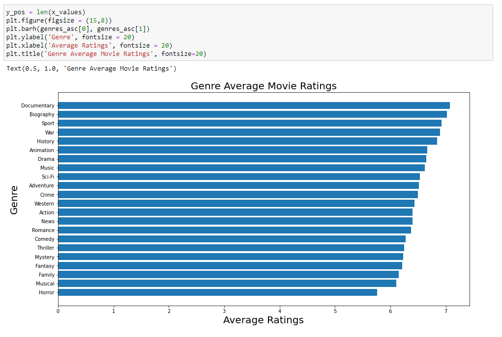
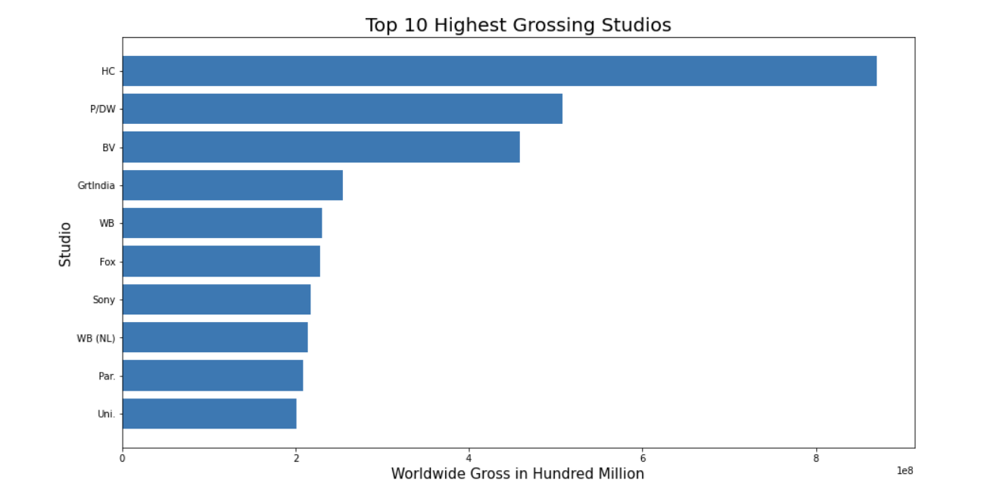
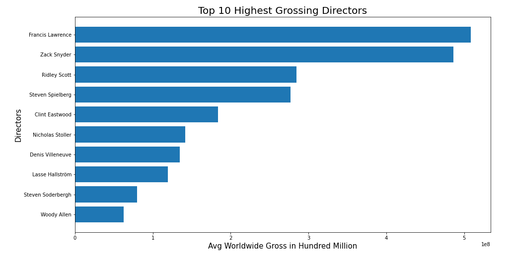

# Phase 1 Project - Movie Analysis

Lauren Petrillo

## Business Problem

I was tasked to create a new movie studio for Microsoft by giving three business recommendations to the Stakeholders. I do this by analyzing data in the movie industry to generate actionable insights in order to become a successful movie studio. I want to explore the highest grossing genres, directors, and studios.

## The Data

Here are the resources I used to perform my data analysis:

* [Box Office Mojo](https://www.boxofficemojo.com/)
* [IMDB](https://www.imdb.com/)
* [Rotten Tomatoes](https://www.rottentomatoes.com/)
* [TheMovieDB](https://www.themoviedb.org/)
* [The Numbers](https://www.the-numbers.com/)

##  Methods

* Findings from Exploratory Data Analysis
* Descriptive Analysis
* Choices Made

## Results

### Gross Visual 1

### Gross Visual 2

### Gross Visual 3

## Recommendations

* Make movies that are Sci-Fi, Adventure, or Animation as they are the top genres that produce the most revenue
* Study the target audience for the top movie studios BV, WB, and Fox. By studying the behavior/trends of consumers, we can capture their data on television rights, videos-on-demand, and streaming services
* Hire popular directors--it can lead to higher revenue for movies

## Next Steps

Some features to explore would be:
* Movie Budget
* ROI
* Time the movie is released
* Target Audience

Gathering more data would help further support our claims when doing future exploration

## For Further Information

Please review the narrative of my analysis in my jupyter notebook or review my presentation

For any additional questions, please contact lauren.petrillo13@gmail.com

### Repository Structure

Here are the contents of my repository

README.md                                                <- The top-level README for reviewers of this project.

Movie Project - lauren.petrillo.ipynb                    <- narrative documentation of analysis in jupyter notebook

Module 1 – Movie Project Presentation.pdf                <- pdf version of project presentation

Images
    

